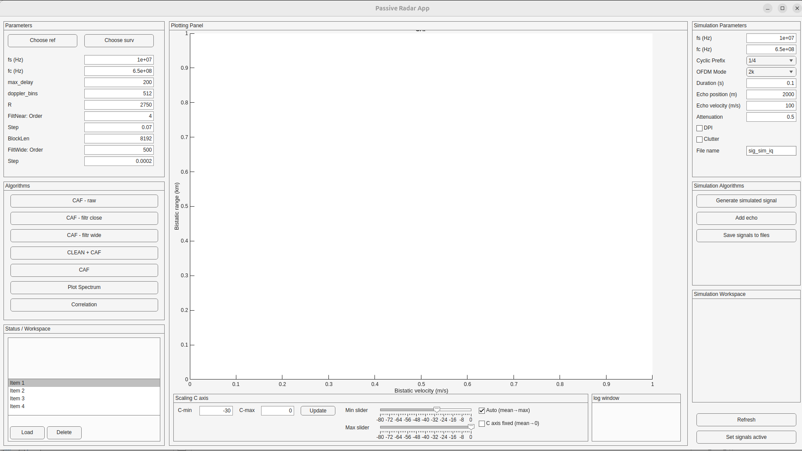

# Passive Radar – Drone Detection and Micro-Doppler Analysis using DVB-T Signals

## Overview

This project implements a **passive radar system** designed to detect and analyze aerial objects such as **drones, aircraft, helicopters, and birds** using **DVB-T (Digital Video Broadcasting – Terrestrial)** signals as an *illuminator of opportunity*.  
It provides a **MATLAB-based GUI application** for signal simulation, processing, and visualization of **Cross-Ambiguity Functions (CAF)**, **filtering stages**, and **CLEAN algorithm results** for micro-Doppler separation.

---

## Table of Contents
1. [Principles of Passive Radar](#principles-of-passive-radar)
2. [System Architecture](#system-architecture)
3. [DVB-T as an Illuminator of Opportunity](#dvbt-as-an-illuminator-of-opportunity)
4. [Challenges in Drone Detection](#challenges-in-drone-detection)
5. [Signal Processing Pipeline](#signal-processing-pipeline)
6. [The CLEAN Algorithm](#the-clean-algorithm)
7. [Simulation Environment](#simulation-environment)
8. [Graphical User Interface (GUI)](#graphical-user-interface-gui)
9. [Results and Visualizations](#results-and-visualizations)
10. [Future Work](#future-work)
11. [Planned Section: Real-Signal Acquisition (GNU Radio)](#planned-section-real-signal-acquisition-gnu-radio)
12. [References](#references)

---

## Principles of Passive Radar

A **passive radar** system detects targets by exploiting **existing non-cooperative transmitters** (such as broadcast TV or FM radio towers) rather than emitting its own signal.

### Basic Concept
It uses two primary channels:
- **Reference channel** – receives the direct path signal from the transmitter.
- **Surveillance channel** – receives echoes reflected from targets.

The target range and velocity are estimated via the **Cross Ambiguity Function (CAF)**:

  <b>(1)</b> &nbsp; 
  $$\large \mathbf{CAF(\tau, f_d) = \int x_{\mathrm{ref}}(t)\, x_{\mathrm{surv}}^*(t-\tau)\, e^{-j2\pi f_d t}\, dt}$$

Where:
- \( \tau \) = time delay (range)
- \( f_d \) = Doppler shift (velocity)
- \( x_\text{ref} \), \( x_\text{surv} \) = reference and surveillance signals

---

## System Architecture

The software simulates and processes signals through several core components:

1. **Signal Simulation** – Generates reference and surveillance channels with user-defined parameters (echo delays, Doppler, attenuation).
2. **CAF Computation** – Performs cross-correlation between reference and surveillance channels.
3. **Filtering Algorithms** – Removes static clutter, direct path interference (DPI), and stationary objects.
4. **CLEAN Algorithm** – Iteratively removes strong target echoes to reveal weaker ones (micro-Doppler sources).
5. **Visualization Panel** – Displays intermediate and final CAFs and signal evolution.

---

## DVB-T as an Illuminator of Opportunity

### Advantages
- **Wideband signal** (~8 MHz bandwidth) → high range resolution  
- **Continuous broadcast** → 24/7 availability  
- **Multiple carriers (OFDM)** → robust to multipath and fading  

### Disadvantages
- **High direct path interference (DPI)** requiring strong filtering  
- **Complex signal structure (OFDM)** introduces sidelobes in CAF  
- **Synchronization sensitivity** (carrier frequency offset, sampling mismatch)

---

## Challenges in Drone Detection

### Micro-Doppler Effect
Micro-Doppler signatures arise from **rotating blades** or **limbs** superimposed on the main body Doppler shift.  
They are critical in differentiating between:
- **Drones** – stable body Doppler + periodic micro-Doppler from propellers  
- **Birds** – irregular, non-harmonic micro-Doppler from flapping wings  

These patterns are usually **masked by clutter** or **stronger echoes** and become visible only **after applying CLEAN algorithm** and proper normalization of CAF.

---

## Signal Processing Pipeline

1. **Input Signals**
   - Reference: DVB-T signal directly received.
   - Surveillance: Combination of echoes + clutter + noise.

2. **Pre-processing**
   - Synchronization, resampling, frequency offset correction.
   - Optional normalization (disabled for power comparison between stages).

3. **CAF Computation**
   - FFT-based or direct correlation.
   - Visualized in delay-Doppler map.

4. **Filtering**
   - Adaptive or wide-band filters to remove static clutter and DPI.
   - Retains moving target components.

5. **CLEAN Algorithm**
   - Removes dominant peaks and reconstructs weaker signals.

6. **Micro-Doppler Analysis**
   - Extracts time-frequency components for drone/bird discrimination.

---

## The CLEAN Algorithm

### Concept

The **CLEAN** algorithm iteratively subtracts the strongest echo from the CAF map to uncover weaker components.  
It models the CAF as a sum of target responses:

  <b>(2)</b> &nbsp;
  $$\large \mathbf{CAF(\tau, f_d) = \sum_i A_i \, \psi(\tau - \tau_i, f_d - f_{d,i}) + N(\tau, f_d)}$$

At each iteration:
1. Find the maximum response \((\tau_i, f_{d,i})\)
2. Subtract a scaled replica of the system point spread function (PSF)
3. Accumulate results until residuals fall below a threshold

### Benefits
- Reveals multiple closely spaced targets
- Unmasks micro-Doppler features
- Reduces false detections from sidelobes

---

## Simulation Environment

The MATLAB simulation module allows:
- Generation of **synthetic DVB-T-like signals**
- Definition of targets with different:
  - Delays (range)
  - Doppler frequencies (velocity)
  - Amplitudes (attenuation)
- Addition of **multiple echoes** or **micro-Doppler components**

### Example Targets
| Target Type | Doppler [Hz] | Attenuation [dB] | Notes |
|--------------|---------------|------------------|-------|
| Drone        | ±100 – 500    | -20 to -30       | Fast propeller harmonics |
| Plane        | ±50 – 200     | -10              | Strong single echo |
| Helicopter   | ±50 – 400     | -15              | Periodic blade micro-Doppler |
| Running Man  | ±10 – 30      | -25              | Low amplitude |
| Bird         | ±50 – 300     | -25 to -35       | Irregular micro-Doppler |

---

## Graphical User Interface (GUI)

The application provides an **interactive GUI** for:
- Signal parameter setup  
- Real-time CAF visualization  
- Filtering and CLEAN processing  
- Multi-category log display (e.g. CAF Power, Running Process, Parameters)

### GUI Screenshots
> **(Placeholder for future screenshots – replace below with actual images)**

- **Main Window (Blank GUI)**  
  

- **After Filtering Steps**  
  

- **After CLEAN Algorithm**  
  

- **Simulation Result**  
  

---

## Results and Visualizations

The application displays:
- CAF in delay-Doppler domain  
- Filtered CAF (clutter suppressed)  
- CLEAN-processed CAF with isolated targets  
- Power difference metrics between processing stages  
- Micro-Doppler spectrograms (optional)

---

## Future Work

- **Real-signal recording support** using SDR (RTL-SDR, HackRF, or USRP)  
- **GNU Radio integration** for reference/surveillance channel acquisition  
- **Machine learning**-based classification of drones vs birds  
- **Performance benchmarking** using real datasets  

---

## Planned Section: Real-Signal Acquisition (GNU Radio)

*(To be completed later)*  
Will include:
- System block diagram  
- DVB-T receiver setup  
- File sink configuration for reference/surveillance capture  
- Post-processing pipeline to import signals into MATLAB GUI  

---

## References

1. Malanowski, M., Kulpa, K. *“Signal Processing in Passive Radar Systems”*. 

---

**Author:** [Maksymilian Zabierowski]  
**Affiliation:** Passive Radar Project  
**Language:** MATLAB  
**License:** MIT License
